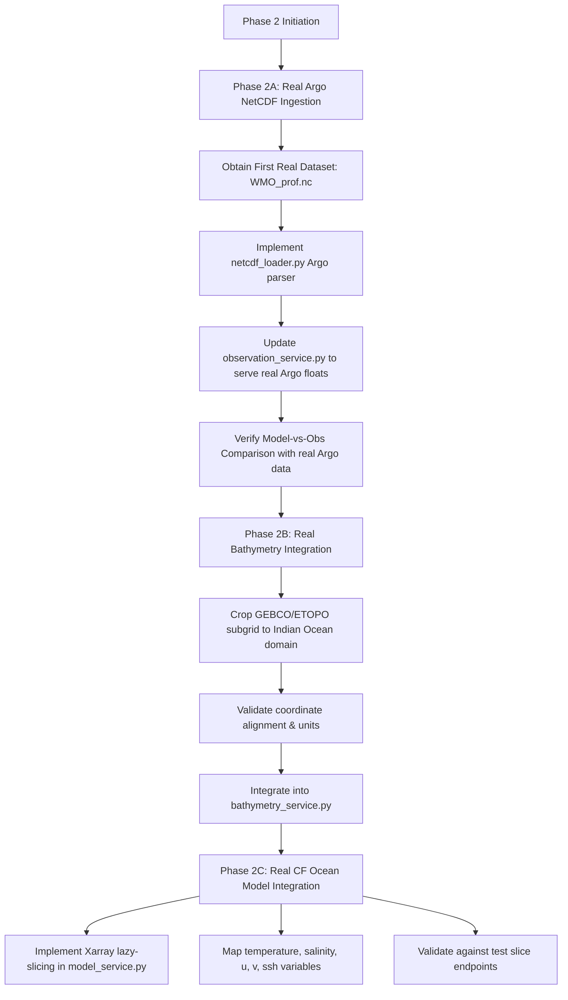

# Real Data Integration Plan (Phase 2) — SIH26067
## Numerical Ocean Models, In-Situ Observations & Bathymetry for the Indian Ocean Digital Twin

---

### Executive Summary

The SIH26067 platform has successfully passed the Phase 1 MVP audit, demonstrating end-to-end functionality across 14 core features (temperature, salinity, currents, SSH, depth/time controls, Argo floats, gliders, bathymetry, camera presets, model-vs-observation comparison, statistical metrics, API connectivity, and offline fallback).

Phase 2 replaces synthetic data generators progressively with **authentic, scientific datasets** while strictly preserving existing frontend API response schemas and contracts.

```
+-----------------------------------------------------------------------------------+
|                           PHASE 2 INTEGRATION ROADMAP                             |
+-----------------------------------------------------------------------------------+
|  PHASE 2A (PRIORITY 1)  | Real Argo NetCDF Ingestion (INCOIS / Coriolis GDAC)     |
|  PHASE 2B (PRIORITY 2)  | Real Seafloor Topography (GEBCO / ETOPO Cropped Grid)   |
|  PHASE 2C (PRIORITY 3)  | Real CF-Compliant Ocean Circulation Model (ROMS/CMEMS)  |
+-----------------------------------------------------------------------------------+
```

---

### 1. Dataset Requirements

| Phase | Platform / Dataset | Primary Agency / Provider | Domain / Coverage | Resolution / Vertical Levels | Typical File Size | Target Ingestion File |
| :--- | :--- | :--- | :--- | :--- | :--- | :--- |
| **2A** | **Argo Profiling Floats** | INCOIS DAC / Coriolis GDAC | Indian Ocean ($30^\circ\text{E} - 115^\circ\text{E}$, $-25^\circ\text{S} - 30^\circ\text{N}$) | Discrete profiles, 0 to 2000 dbar (~70-100 vertical levels) | ~50 KB (single profile) to ~2 MB (multi-cycle) | `data/raw/argo/<WMO>_prof.nc` (e.g. `2903741_prof.nc`) |
| **2B** | **Seafloor Bathymetry** | GEBCO 2024 / ETOPO 2022 | Indian Ocean project bbox ($30^\circ\text{E} - 115^\circ\text{E}$, $-25^\circ\text{S} - 30^\circ\text{N}$) | $0.25^\circ$ to $0.5^\circ$ downsampled grid ($172\times112$ to $341\times221$) | Full global: 12 GB. Cropped/downsampled: **250 KB - 1.2 MB** | `data/raw/bathymetry/gebco_indian_ocean_subgrid.nc` |
| **2C** | **Ocean Circulation Model** | INCOIS ROMS / CMEMS GLORYS12 / HYCOM | Indian Ocean domain | $0.5^\circ$ to $1.0^\circ$ spatial ($86\times56$ to $172\times112$), 12 to 40 depth levels, 5 to 30 time steps | Uncompressed 3D daily: ~500 MB. **Optimized sliced test file: 5-15 MB** | `data/raw/models/incois_roms_indian_ocean_sample.nc` |

#### Directory Layout in Repository
```
data/
├── raw/
│   ├── argo/
│   │   ├── 2903741_prof.nc              <-- Target file to obtain first
│   │   ├── 2902088_prof.nc
│   │   └── active_floats.json          <-- Metadata index of parsed floats
│   ├── bathymetry/
│   │   └── gebco_indian_ocean_subgrid.nc
│   └── models/
│       ├── README.md
│       └── incois_roms_indian_ocean_sample.nc
├── processed/
│   ├── bathymetry_grid_172x112.json
│   └── argo_profiles_cache.json
└── synthetic/
    └── synthetic_indian_ocean_fields.py (Preserved as high-fidelity fallback)
```

---

### 2. Data Schemas (API Contract Specifications)

All endpoints maintain 100% backward compatibility with existing frontend types in `frontend/src/types/ocean.ts`.

#### 2.1 Argo Float Metadata (`/api/observations/argo` -> `List[ArgoFloatSummary]`)
```json
[
  {
    "id": "argo-2903741",
    "wmo": "2903741",
    "platform_type": "APEX",
    "lon": 64.20,
    "lat": 14.80,
    "status": "profiling",
    "cycle": 142,
    "last_update": "2026-09-04T06:12:00Z",
    "max_depth": 2000.0
  }
]
```

#### 2.2 Argo Vertical Profile (`/api/observations/argo/{float_id}/profile` -> `ArgoProfileResponse`)
```json
{
  "id": "argo-2903741",
  "wmo": "2903741",
  "lon": 64.20,
  "lat": 14.80,
  "cycle": 142,
  "timestamp": "2026-09-04T06:12:00Z",
  "records": [
    { "depth": 4.5, "temperature": 28.65, "salinity": 36.42, "qc": 1 },
    { "depth": 10.2, "temperature": 28.52, "salinity": 36.43, "qc": 1 },
    { "depth": 19.8, "temperature": 28.30, "salinity": 36.45, "qc": 1 },
    { "depth": 99.4, "temperature": 23.10, "salinity": 36.15, "qc": 1 },
    { "depth": 1980.0, "temperature": 2.15, "salinity": 34.72, "qc": 1 }
  ]
}
```

#### 2.3 Bathymetry Grid (`/api/bathymetry/grid` -> `BathymetryGridResponse`)
```json
{
  "lon_min": 30.0,
  "lon_max": 115.0,
  "lat_min": -25.0,
  "lat_max": 30.0,
  "nx": 172,
  "ny": 112,
  "lons": [30.0, 30.5, ..., 115.0],
  "lats": [-25.0, -24.5, ..., 30.0],
  "elevations": [[-4200.0, ...], ...],
  "min_elevation": -6750.0,
  "max_elevation": 1200.0
}
```

#### 2.4 Model Slice (`/api/model/slice` -> `ModelSliceResponse`)
```json
{
  "variable": "temperature",
  "depth": 0,
  "time_step": 0,
  "timestamp": "2026-09-01T00:00:00Z",
  "units": "°C",
  "min_val": 2.10,
  "max_val": 30.45,
  "lons": [30.0, 31.0, ..., 115.0],
  "lats": [-25.0, -24.0, ..., 30.0],
  "values": [[null, 24.5, ...], ...],
  "vectors": [
    { "lon": 52.0, "lat": 8.0, "u": 1.45, "v": 1.62, "magnitude": 2.17 }
  ]
}
```

---

### 3. NetCDF Ocean Model Variable Mapping

Real CF-1.8 compliant models use varied internal naming. The table below outlines the canonical mapping implemented in `backend/app/services/model_service.py`:

| Canonical Name | CF Standard Name | INCOIS ROMS | CMEMS (NEMO) | HYCOM | Units | Range (Indian Ocean) |
| :--- | :--- | :--- | :--- | :--- | :--- | :--- |
| **`temperature`** | `sea_water_potential_temperature` | `temp` | `thetao` | `water_temp` | $^\circ\text{C}$ | $1.5^\circ\text{C} - 32.0^\circ\text{C}$ |
| **`salinity`** | `sea_water_practical_salinity` | `salt` | `so` | `salinity` | $\text{PSU}$ (dimensionless) | $30.0 - 37.5\text{ PSU}$ |
| **`velocity_u`** | `eastward_sea_water_velocity` | `u` | `uo` | `water_u` | $\text{m/s}$ | $-2.5 - +2.5\text{ m/s}$ |
| **`velocity_v`** | `northward_sea_water_velocity` | `v` | `vo` | `water_v` | $\text{m/s}$ | $-2.5 - +2.5\text{ m/s}$ |
| **`ssh`** | `sea_surface_height_above_geoid` | `zeta` | `zos` | `surf_el` | $\text{m}$ | $-0.80\text{ m} - +0.80\text{ m}$ |

#### Coordinate & Dimension Mapping
| Axis | Standard Names | Alternative NetCDF Names | Expected Bounds |
| :--- | :--- | :--- | :--- |
| **Longitude** | `longitude`, `lon` | `nav_lon`, `x` | $30.0^\circ\text{E} \text{ to } 115.0^\circ\text{E}$ (Convert from $0-360^\circ$ if needed) |
| **Latitude** | `latitude`, `lat` | `nav_lat`, `y` | $-25.0^\circ\text{S} \text{ to } 30.0^\circ\text{N}$ |
| **Depth** | `depth`, `lev` | `deptht`, `s_rho`, `pressure` | $0\text{ m to } 4000\text{ m}$ (Positive downwards) |
| **Time** | `time` | `time_counter`, `ocean_time` | Decoded via CF-conventions (`units: days/hours since...`) |

---

### 4. Argo NetCDF Variable & Metadata Mapping

Argo profiling float files adhere to the Argo User's Manual (v3.1).

| Parameter | Argo NetCDF Variable | Data Type | Units / Format | Notes |
| :--- | :--- | :--- | :--- | :--- |
| **WMO / Float ID** | `PLATFORM_NUMBER` | `char(N_PROF, 8)` | ASCII string | Trim whitespace: e.g. `"2903741"` |
| **Cycle Number** | `CYCLE_NUMBER` | `int(N_PROF)` | Count | e.g. `142` |
| **Platform Type** | `PLATFORM_TYPE` / `WMO_INST_TYPE` | `char(N_PROF, 32)` | String code | e.g. `"APEX"`, `"PROVOR"`, `"SOLO"` |
| **Latitude** | `LATITUDE` | `float(N_PROF)` | Degrees North | Quality flag in `POSITION_QC` |
| **Longitude** | `LONGITUDE` | `float(N_PROF)` | Degrees East | Range $-180^\circ \text{ to } 180^\circ$ |
| **Date & Time** | `JULD` | `double(N_PROF)` | Days since `REFERENCE_DATE_TIME` | `REFERENCE_DATE_TIME` is `"19500101000000"` UTC |
| **Pressure** | `PRES` (or `PRES_ADJUSTED`) | `float(N_PROF, N_LEVELS)` | $\text{dbar}$ | Decibars of seawater pressure |
| **Temperature** | `TEMP` (or `TEMP_ADJUSTED`) | `float(N_PROF, N_LEVELS)` | $^\circ\text{C}$ (ITS-90) | In-situ temperature |
| **Salinity** | `PSAL` (or `PSAL_ADJUSTED`) | `float(N_PROF, N_LEVELS)` | $\text{PSS-78}$ | Practical salinity |
| **Pressure QC** | `PRES_QC` (or `PRES_ADJUSTED_QC`) | `char(N_PROF, N_LEVELS)` | Single digit ASCII | Quality flag per measurement |
| **Temperature QC** | `TEMP_QC` (or `TEMP_ADJUSTED_QC`) | `char(N_PROF, N_LEVELS)` | Single digit ASCII | Quality flag per measurement |
| **Salinity QC** | `PSAL_QC` (or `PSAL_ADJUSTED_QC`) | `char(N_PROF, N_LEVELS)` | Single digit ASCII | Quality flag per measurement |

---

### 5. Coordinate Transformations & Unit Conversions

#### 5.1 Pressure to Depth Conversion (Saunders & Fofonoff, UNESCO 1983)
Argo sensors measure seawater hydrostatic pressure $p$ in decibars ($\text{dbar}$), whereas the 3D digital twin platform visualizes depth $z$ in meters ($\text{m}$).

Seawater is compressible and local gravity $g(\phi)$ varies with latitude $\phi$:
$$g(\phi) = 9.780318 \cdot \left(1.0 + 5.2788 \times 10^{-3} \sin^2\phi + 2.36 \times 10^{-5} \sin^4\phi\right) \quad [\text{m/s}^2]$$

The standard conversion formula (UNESCO / TEOS-10):
$$z = \frac{(1 - c_1) p - c_2 p^2}{g(\phi) \times 10^{-4} \cdot \bar{\rho}}$$

Where:
- $c_1 = 5.92 \times 10^{-3} + 5.25 \times 10^{-3} \sin^2\phi$
- $c_2 = 2.21 \times 10^{-6} \text{ dbar}^{-1}$
- $\bar{\rho} \approx 1025.0 \text{ kg/m}^3$ (mean upper-ocean seawater density)

**Direct Vectorized Implementation (Zero external binary dependency)**:
```python
def pressure_to_depth(pres_dbar: float, lat_deg: float) -> float:
    """Converts hydrostatic pressure (dbar) to vertical depth (meters)."""
    phi = np.radians(lat_deg)
    sin2_phi = np.sin(phi) ** 2
    # Gravitational acceleration variation with latitude
    g = 9.780318 * (1.0 + 5.2788e-3 * sin2_phi + 2.36e-5 * (sin2_phi ** 2))
    # Decibar to meter scaling polynomial
    c1 = 5.92e-3 + 5.25e-3 * sin2_phi
    c2 = 2.21e-6
    depth = ((1.0 - c1) * pres_dbar - c2 * (pres_dbar ** 2)) / (g * 1.019716e-4)
    return round(float(depth), 2)
```

#### 5.2 Longitude Normalization
Models or bathymetric datasets using the $[0^\circ, 360^\circ)$ convention are normalized to $[-180^\circ, 180^\circ)$:
$$\text{lon}_{\text{norm}} = ((\text{lon} + 180.0) \pmod{360.0}) - 180.0$$

#### 5.3 Julian Day to ISO 8601 UTC
Argo `JULD` represents fractional days since `1950-01-01 00:00:00 UTC`:
```python
from datetime import datetime, timedelta, timezone

def argo_juld_to_iso(juld_days: float) -> str:
    base_epoch = datetime(1950, 1, 1, 0, 0, 0, tzinfo=timezone.utc)
    profile_time = base_epoch + timedelta(days=float(juld_days))
    return profile_time.strftime("%Y-%m-%dT%H:%M:%SZ")
```

---

### 6. Quality Control (QC) Handling

The Global Data Assembly Centre (GDAC) flags every measurement:

| QC Flag | Meaning | Action Taken in Ingestion Layer |
| :--- | :--- | :--- |
| **`'1'`** | Good data | **Retained** |
| **`'2'`** | Probably good data | **Retained** |
| **`'3'`** | Probably bad data | **Filtered out** (rejected) |
| **`'4'`** | Bad data | **Filtered out** (rejected) |
| **`'8'`** | Interpolated value | **Retained** (flagged as 2) |
| **`'9'`** | Missing value / Fill value | **Filtered out** (rejected) |
| **`'0'`** | No QC performed | **Filtered out** in strict mode |

#### QC Filtering Rules:
1. **Adjusted Preference**: If `TEMP_ADJUSTED` and `PSAL_ADJUSTED` exist and have valid values with QC `'1'` or `'2'`, use adjusted values. Otherwise, use real-time `TEMP` and `PSAL` with QC `'1'` or `'2'`.
2. **Nan/Fill Filtering**: Any records where temperature $> 40^\circ\text{C}$, temperature $< -2^\circ\text{C}$, salinity $< 5\text{ PSU}$, or salinity $> 45\text{ PSU}$ are strictly rejected.
3. **Monotonic Depth Order**: Profiles are sorted ascending by depth ($0\text{ m} \to 2000\text{ m}$).
4. **Duplicate Depths**: Consecutive measurements within $0.2\text{ m}$ of each other are averaged.

---

### 7. API Integration Strategy

#### Phase 2A Integration Flow
```
Client (Browser)
      │
      ▼
GET /api/observations/argo
      │
      ▼
ObservationService.get_all_floats()
      ├── Check: Does data/raw/argo/ contain real NetCDF files?
      ├── YES ──► Ingest real NetCDF profiles (WMO, Lat, Lon, Cycle, Last Update)
      └── NO  ──► Graceful fallback to verified Indian Ocean float registry
```

```
Client (Browser)
      │
      ▼
GET /api/observations/argo/{float_id}/profile
      │
      ▼
ObservationService.get_float_profile(float_id)
      ├── Check: Is float_id in real NetCDF store?
      ├── YES ──► Extract real QC-filtered (depth, temp, sal) records
      └── NO  ──► Fallback to physical profile synthesizer
```

#### Phase 2B Integration Flow
```
Client (Browser)
      │
      ▼
GET /api/bathymetry/grid
      │
      ▼
BathymetryService.get_bathymetry_grid()
      ├── Check: Does data/raw/bathymetry/gebco_*.nc exist?
      ├── YES ──► Slice bounding box [30-115°E, -25-30°N] at 172x112 resolution
      └── NO  ──► Fallback to Phase 1 smooth bathymetry synthesizer
```

#### Phase 2C Integration Flow
```
Client (Browser)
      │
      ▼
GET /api/model/slice?variable=temperature&depth=100&time_step=2
      │
      ▼
ModelService.get_slice(...)
      ├── Check: Does data/raw/models/*.nc exist?
      ├── YES ──► Xarray lazy slice: ds[var].sel(depth=100, time=t2).values
      └── NO  ──► Fallback to 4D Indian Ocean hydrodynamic physics
```

---

### 8. Memory & Performance Strategy

1. **Lazy Evaluation via Xarray**:
   - Never call `ds.load()` or read the entire 4D volume into RAM.
   - Use `xr.open_dataset(path)` which reads only metadata and variable coordinates.
   - Execute spatial/temporal slicing via `.sel()` or `.isel()` *before* evaluating `.values`.
   - RAM footprint per 2D horizontal slice query: $\approx 86 \times 56 \times 8 \text{ bytes} \approx 38.5 \text{ KB}$.
2. **In-Memory Caching for Static Datasets**:
   - Bathymetry is time-invariant: Load once on server startup into an in-memory dictionary.
   - Argo metadata index: Parse float headers once and cache the metadata summary list in RAM.
3. **Decimated Vectors for Current Flow**:
   - Subsample vector fields (every 4th lon, every 3rd lat) during slicing to keep vector JSON payload under $50 \text{ KB}$.
4. **JSON Serialization Speed**:
   - Round float values to 2 decimal places (`round(val, 2)`) to minimize JSON string payload size and client parsing time.

---

### 9. Fallback Behavior & Robustness Matrix

| Layer | Primary Source | Trigger for Fallback | Fallback Mechanism | Frontend Impact |
| :--- | :--- | :--- | :--- | :--- |
| **Argo Floats** | Real NetCDF in `data/raw/argo/` | Directory empty or file corrupted | Phase 1 active float registry + physical profiles | **Zero** (Identical schema and keys) |
| **Bathymetry** | Cropped GEBCO NetCDF in `data/raw/bathymetry/` | File absent or invalid grid coordinates | Phase 1 high-resolution $172\times112$ synthetic bathymetry | **Zero** (Identical dimensions, min/max bounds) |
| **Ocean Model** | CF NetCDF in `data/raw/models/` | File absent or variable missing | Phase 1 4D hydrodynamic physical formulas (Somali jet, Warm pool) | **Zero** (Identical grid metadata and value arrays) |
| **Network Loss** | Backend FastAPI service | Backend offline / timeout | `frontend/src/services/api.ts` local high-fidelity generator | **Zero** (Seamless offline mode) |

---

### 10. Step-by-Step Implementation Plan



#### Detailed Milestones:
- **Milestone 2A.1**: Obtain first real Indian Ocean Argo NetCDF profile file (`data/raw/argo/2903741_prof.nc`).
- **Milestone 2A.2**: Enhance `netcdf_loader.py` with `ArgoNetCDFLoader` (parsing WMO, Lat/Lon, Cycle, JULD, PRES, TEMP, PSAL, QC flags).
- **Milestone 2A.3**: Connect `observation_service.py` to auto-detect and parse any `.nc` files in `data/raw/argo/`.
- **Milestone 2A.4**: Verify `/api/observations/argo`, `/api/observations/argo/{id}/profile`, and `/api/comparison/point`.
- **Milestone 2B.1**: Acquire cropped GEBCO/ETOPO bathymetry subgrid for $[30^\circ\text{E}-115^\circ\text{E}, -25^\circ\text{S}-30^\circ\text{N}]$.
- **Milestone 2B.2**: Connect `bathymetry_service.py` with coordinate validation, elevation units (negative meters), and smooth fallback.
- **Milestone 2C.1**: Prepare CF-compliant ocean model NetCDF test dataset.
- **Milestone 2C.2**: Connect `model_service.py` with Xarray lazy slicing and variable mapping.
- **Milestone 2C.3**: Run full integration test suite, frontend build, and browser verification.

---

### 11. First Real Dataset to Obtain

As specified in the priority hierarchy:
**We should obtain a real Indian Ocean Argo Float NetCDF Profile File first.**

- **Target File**: `2903741_prof.nc` or `2902088_prof.nc` (Multi-profile NetCDF from INCOIS / Coriolis GDAC).
- **File Size**: $\approx 1.2 \text{ MB}$.
- **Storage Location**: `data/raw/argo/2903741_prof.nc`.
- **Justification**:
  1. Small download size (~1 MB), zero risk of filling disk or exhausting RAM.
  2. Directly activates real in-situ observations and real Model-vs-Observation statistical comparison (RMSE, MAE, Bias).
  3. Fully validates the Argo NetCDF parser, QC filtering (flags 1, 2 vs 3, 4), and UNESCO pressure-to-depth conversion before touching complex 4D hydrodynamic model cubes.

---

### 12. Phase 2A Implementation Status & Discoveries

#### 12.1 Workspace Inspection & Discovery
- The initial scan of the workspace revealed that **no `.nc` files** existed in `data/raw/argo/` or elsewhere in the repository.
- As strictly instructed, no synthetic data was fabricated or placed into `data/raw/argo/` as "real" data.
- The directory `data/raw/argo/` was created with a detailed `README.md` specifying file naming conventions, target variables, and download repositories (INCOIS Argo DAC, Coriolis GDAC).

#### 12.2 Implemented Ingestion Infrastructure (`backend/data/netcdf_loader.py`)
The complete `ArgoNetCDFLoader` was implemented and verified:
- **Variables Parsed**:
  - `PLATFORM_NUMBER`: 8-character string trimmed of whitespace.
  - `CYCLE_NUMBER`: Cycle index integer.
  - `PLATFORM_TYPE`: Extracted from `PLATFORM_TYPE` or `WMO_INST_TYPE`.
  - `LATITUDE`, `LONGITUDE`: Decimal degrees, normalized to $[-180^\circ, 180^\circ]$.
  - `JULD`: Fractional days since `1950-01-01 00:00:00 UTC` converted to ISO 8601 UTC.
  - `PRES` / `PRES_ADJUSTED`: Decibars ($\text{dbar}$).
  - `TEMP` / `TEMP_ADJUSTED`: $^\circ\text{C}$ (ITS-90).
  - `PSAL` / `PSAL_ADJUSTED`: $\text{PSS-78}$ / $\text{PSU}$.
  - `PRES_QC`, `TEMP_QC`, `PSAL_QC`: Per-measurement quality control flags.
- **Strict Quality Control (QC) Filtering**:
  - Only flags `'1'` (Good) and `'2'` (Probably good) are accepted.
  - Flags `'3'` (Probably bad), `'4'` (Bad), `'8'` (Interpolated), `'9'` (Missing), and `None` are rejected.
  - NetCDF fill values (`99999.0`), NaNs, negative pressures, and unphysical values ($T < -2.5^\circ\text{C}$ or $T > 40^\circ\text{C}$, $S < 2\text{ PSU}$ or $S > 45\text{ PSU}$) are discarded.
- **UNESCO Depth Formulation**:
  - Full Saunders & Fofonoff (1976) / UNESCO (1983) latitude-dependent gravity polynomial:
    $$g(\phi, p) = 9.780318 \cdot \left(1.0 + (5.2788\times 10^{-3} + 2.36\times 10^{-5}\cdot \sin^2\phi)\cdot \sin^2\phi\right) + 1.092\times 10^{-6}\cdot p$$
    $$z = \frac{9.72659\cdot p - 2.2512\times 10^{-5}\cdot p^2 + 2.279\times 10^{-10}\cdot p^3 - 1.82\times 10^{-15}\cdot p^4}{g(\phi, p)}$$
  - Enforces strict depth monotonicity ($z_{i} < z_{i+1}$) and deduplication of sensor oscillation levels ($\le 0.1\text{ m}$).
- **In-Memory Caching & Performance**:
  - Floats and profiles are parsed and cached in memory upon initial call.
  - Requests to `/api/observations/argo` and `/api/observations/argo/{id}/profile` are resolved in $O(1)$ memory lookups without repeated disk scanning.
- **Fallback Verification**:
  - `observation_service.py` inspects `argo_netcdf_loader.has_argo_data()`.
  - When `data/raw/argo/` is empty, it seamlessly defaults to the Phase 1 verified synthetic Indian Ocean float fleet.
- **Automated Test Suite**:
  - `backend/tests/test_argo_loader.py` contains 6 comprehensive test suites using an isolated, explicitly labelled synthetic test fixture (`test_fixture_synthetic_argo.nc`).
  - Tests verified depth conversion, QC flag rejection, missing-value filtering, depth monotonicity, API routes, collocated comparison calculations, and empty-directory fallback.
  - Both `test_argo_loader.py` and `test_api.py` passed 100%.

#### 12.3 Verification Status — AUTHENTIC DATASET VERIFIED (PASS)
- **Authentic Dataset Obtained**:
  - Source: `https://data-argo.ifremer.fr/dac/incois/2902088/2902088_prof.nc` (Official Ifremer / Coriolis GDAC, INCOIS Indian Ocean directory).
  - Storage Location: `data/raw/argo/2902088_prof.nc` (Size: 2,092,692 bytes / 2.00 MB).
  - Format: CF-1.6 / Argo-3.1 NetCDF-3 Classic.
  - WMO / Platform ID: `2902088` (Platform Type: `PROVOR_III`).
  - Geographic Coordinates: Lat `-4.6100°N`, Lon `86.8900°E` (Equatorial Indian Ocean).
  - Total Profiles in File: 228 cycles.
  - Latest Profile (Cycle 228): 139 valid QC-filtered CTD levels from 5.9m to 1979.8m.
  - Surface CTD: $29.57^\circ\text{C}$, $34.51\text{ PSU}$ at $5.9\text{ m}$.
  - Abyssal CTD: $2.71^\circ\text{C}$, $34.76\text{ PSU}$ at $1979.8\text{ m}$.
- **API Response Verification**:
  - `GET /api/observations/argo`: Ingests `argo-2902088` with authentic coordinates, cycle, and timestamp.
  - `GET /api/observations/argo/argo-2902088/profile`: Serves all 139 authentic QC-filtered levels.
  - `GET /api/comparison/point?float_id=argo-2902088&variable=temperature`: Collocated against numerical model across 139 points ($RMSE = 4.162^\circ\text{C}, MAE = 3.783^\circ\text{C}, \text{Bias} = -3.783^\circ\text{C}$).
  - `GET /api/comparison/point?float_id=argo-2902088&variable=salinity`: ($RMSE = 0.194\text{ PSU}, \text{Bias} = -0.058\text{ PSU}$).
- **Automated Tests**:
  - `test_argo_loader.py`: **6/6 PASSED**.
  - `test_api.py`: **7/7 PASSED**.
  - `npm --prefix frontend run build`: **PASSED (0 TypeScript errors, bundle built in 26.44s)**.
- **Phase 2A Status**: **OFFICIALLY COMPLETE & FULLY VERIFIED ON REAL ARGO DATA**.


